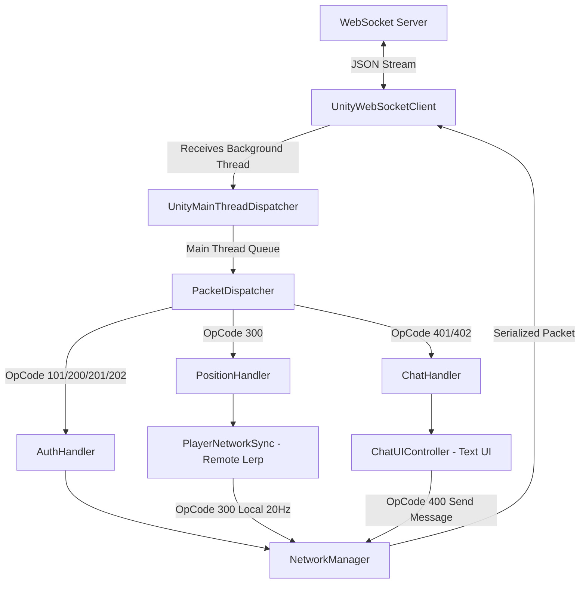

# Entorno de Ejecución en Unity (`Runtime`)

El directorio `Runtime` contiene todo el código ejecutable de red para el cliente de Unity, estructurado en capas desacopladas con inversión de dependencias y responsabilidad única.

---

## Estructura Modular

```
Runtime/
├── Core/               # Sincronización de hilos (UnityMainThreadDispatcher) y estados
│   └── README.md
├── Connection/         # Cliente nativo ClientWebSocket y abstracción IWebSocketClient
│   └── README.md
├── Protocol/           # OpCodes, sobres de red (NetworkPacket) y DTOs serializables
│   ├── DTOs/
│   │   └── README.md
│   └── README.md
├── Handlers/           # Enrutador y manejadores de paquetes (Auth, Position, Chat)
│   └── README.md
├── Controllers/        # Componentes MonoBehaviour para la escena (NetworkManager, Sync, ChatUI)
│   └── README.md
└── README.md
```

---

## Flujo de Datos en el Cliente Unity


