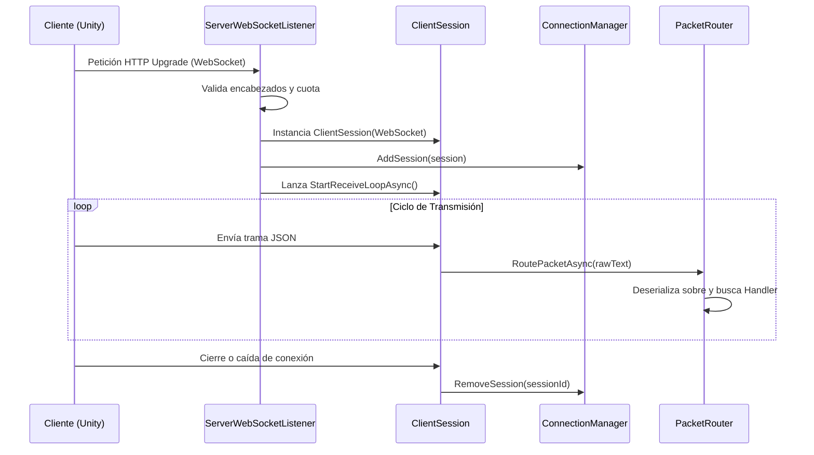

# Capa de Red (`Network`)

La capa `Network` implementa la infraestructura de comunicaciones asíncrona sobre WebSockets nativos de .NET (`System.Net.HttpListener` y `System.Net.WebSockets.WebSocket`), ofreciendo control de concurrencia y tolerancia a fallos sin librerías externas.

---

## Componentes

### 1. `ServerWebSocketListener.cs`
- Escucha peticiones HTTP entrantes y efectúa la actualización de protocolo (*Upgrade*) a WebSocket.
- Configura tamaños de búfer y latidos automáticos (*Keep-Alive Interval*).
- Valida la cuota de conexiones activas contra `MaxConcurrentConnections`.

### 2. `ClientSession.cs`
- Representa a un cliente conectado de forma individual.
- Implementa un semáforo de sincronización `SemaphoreSlim(1, 1)` para garantizar que el método `WebSocket.SendAsync` no sufra condiciones de carrera (*Race Conditions*) cuando múltiples hilos intenten emitir paquetes simultáneamente al mismo cliente.
- Ejecuta un ciclo continuo no bloqueante de recepción que recompone fragmentos mediante `MemoryStream` hasta obtener el mensaje UTF-8 completo.

### 3. `ConnectionManager.cs`
- Colección concurrente (`ConcurrentDictionary`) con todas las sesiones activas indexadas por `SessionId`.
- Proporciona primitivas de difusión:
  - `BroadcastAsync(message)`: Envía en paralelo a todos los clientes.
  - `BroadcastExceptAsync(message, excludeSessionId)`: Envía a todos omitiendo al emisor (vital para replicación de movimiento).

### 4. `PacketRouter.cs`
- Enrutador que extrae el sobre de red (`NetworkPacket`).
- Resuelve nativamente las solicitudes de latencia `Ping` devolviendo `Pong`.
- Despacha de forma desacoplada la carga útil (`Payload`) a la clase que implemente `IPacketHandler` registrada para ese `OpCode`.

---

## Flujo de Vida de una Conexión

