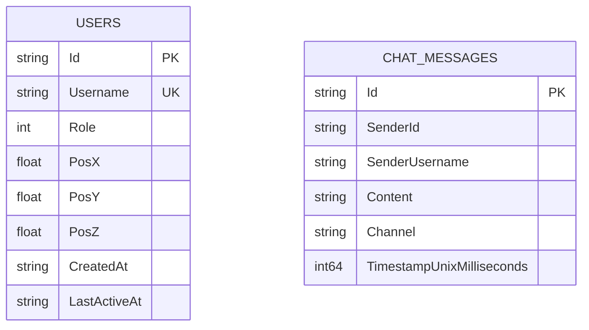

# Capa de Persistencia y Base de Datos (`Persistence`)

El módulo `Persistence` proporciona una solución de base de datos embebida, ultraligera y de máximo rendimiento utilizando el motor oficial `Microsoft.Data.Sqlite` para .NET, optimizado específicamente para escenarios de juegos multijugador con alta concurrencia de lecturas y escrituras.

---

## Características de Rendimiento

1. **Modo WAL (Write-Ahead Logging)**:
   - Activado mediante `PRAGMA journal_mode = WAL;`.
   - Permite que múltiples clientes lean el estado de jugadores o mensajes de chat concurrentemente mientras el servidor escribe actualizaciones de posición sin bloqueos de tabla.

2. **Sincronización `NORMAL`**:
   - `PRAGMA synchronous = NORMAL;` reduce drásticamente las llamadas costosas de volcado a disco (*fsync*) sin arriesgar la integridad de la base de datos.

3. **Memoria Temporal**:
   - `PRAGMA temp_store = MEMORY;` y `PRAGMA busy_timeout = 5000;` para resolución instantánea de consultas intermedias y reintentos ante contención.

4. **Prevención contra Inyecciones SQL**:
   - Todas las consultas están estrictamente parametrizadas (`$id`, `$username`, etc.).

---

## Esquema de Datos

---

## Componentes

- **`DatabaseConnectionFactory.cs`**: Fábrica asíncrona de conexiones SQLite (`SqliteConnection`).
- **`DatabaseInitializer.cs`**: Asegura la creación de tablas, índices compuestos (`idx_chat_channel_time`) y sembrado inicial de datos administrativos.
- **`SqliteUserRepository.cs`**: Operaciones CRUD e inserción/actualización atómica (*UPSERT*) para usuarios y coordenadas.
- **`SqliteChatRepository.cs`**: Almacenamiento y recuperación rápida con ordenamiento temporal de historial de chat.
